# Hi 👋, I'm Arnav

### Engineer • Developer • Problem Solver

  

> Building, learning, and turning ideas into real-world solutions.

---

## 👨‍💻 About Me

* 🔭 Currently working on **[Smart Transport Management System](https://github.com/Arnav-saini2007/Smart-transport-Management-System)**
* 🌱 Currently learning **Java**
* 💬 Ask me about **C**
* 📫 Reach me at **[arnav.saini.120407@gmail.com](mailto:arnav.saini.120407@gmail.com)**
* ⚡ Fun fact: **The sky is blue... most of the time.**

---

## 🤝 Connect With Me

  
  

---

## 🛠️ Languages & Tools

 

 

  
  
  
  

---

# 📊 GitHub Analytics

<picture>
  <source media="(prefers-color-scheme: dark)" srcset="./assets/overview.dark.svg">
  
</picture>

## 📈 Contribution Activity

---

## 🐍 Contribution Snake

<picture>
  <source media="(prefers-color-scheme: dark)" srcset="https://raw.githubusercontent.com/Arnav-saini2007/Arnav-saini2007/output/github-contribution-grid-snake-dark.svg">
  <source media="(prefers-color-scheme: light)" srcset="https://raw.githubusercontent.com/Arnav-saini2007/Arnav-saini2007/output/github-contribution-grid-snake.svg">
  
</picture>

---

### 💻 Code. Build. Learn. Repeat.

